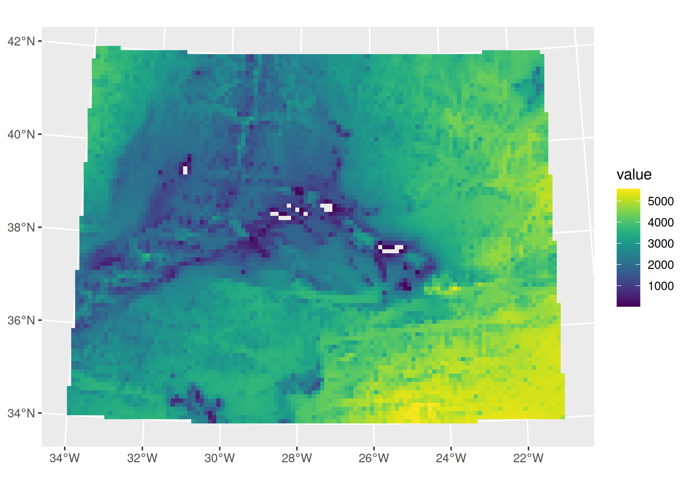
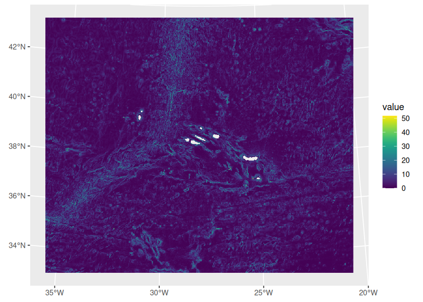

<!-- README.md is generated from README.Rmd. Please edit that file -->

# azores.bathymetry

<!-- badges: start -->
<!-- badges: end -->

The goal of azores.bathymetry is to generate easily SpatRaster objects
for bathymetry, depth, elevation and slope at sea (`depth_slope`).

## Installation

``` r
pak::pak("patterninstitute/azores.bathymetry")
```

## Basic usage

To generate a SpatRaster with depth values (meters) with a grid
resolution of 10000 meters:

``` r
library(azores.bathymetry)

bathymetry(var = "depth", resolution = 10000) |>
  tidyterra::autoplot()
```



For the slope at sea with a resolution of 500 meters:

``` r
bathymetry(var = "depth_slope", resolution = 500) |>
  tidyterra::autoplot()
#> <SpatRaster> resampled to 500808 cells.
```


