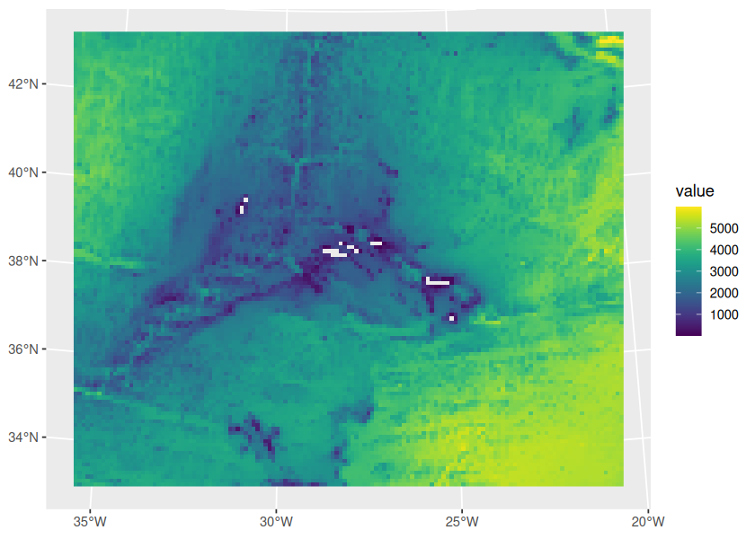

<!-- README.md is generated from README.Rmd. Please edit that file -->

# azores.bathymetry

<!-- badges: start -->
<!-- badges: end -->

The goal of azores.bathymetry is to generate easily SpatRaster objects
for bathymetry, depth, elevation and slope at sea (`depth_slope`).

## Installation

``` r
pak::pak("patterninstitute/azores.bathymetry")
```

## Basic usage

To generate a SpatRaster with depth values (meters) with a grid
resolution of 10000 meters:

``` r
library(azores.bathymetry)

(depth_res_10000 <- bathymetry(var = "depth", resolution = 10000))
#> class       : SpatRaster 
#> dimensions  : 115, 139, 1  (nrow, ncol, nlyr)
#> resolution  : 10000, 10000  (x, y)
#> extent      : -7e+05, 690000, -590000, 560000  (xmin, xmax, ymin, ymax)
#> coord. ref. : +proj=laea +lat_0=38.5 +lon_0=-28 +x_0=0 +y_0=0 +datum=WGS84 +units=m +no_defs 
#> source(s)   : memory
#> varname     : Depth (Depth relative to sea level) 
#> name        : depth 
#> min value   :     9 
#> max value   :  5987
```

``` r
tidyterra::autoplot(depth_res_10000)
```



For the slope at sea with a resolution of 500 meters:

``` r

(depth_slope_res_500 <- bathymetry(var = "depth_slope", resolution = 500))
#> class       : SpatRaster 
#> dimensions  : 2300, 2770, 1  (nrow, ncol, nlyr)
#> resolution  : 500, 500  (x, y)
#> extent      : -7e+05, 685000, -590000, 560000  (xmin, xmax, ymin, ymax)
#> coord. ref. : +proj=laea +lat_0=38.5 +lon_0=-28 +x_0=0 +y_0=0 +datum=WGS84 +units=m +no_defs 
#> source(s)   : memory
#> varname     : Slope 
#> name        :    Slope 
#> min value   :  0.00000 
#> max value   : 58.56421
```

``` r
tidyterra::autoplot(depth_slope_res_500)
#> <SpatRaster> resampled to 500520 cells.
```


